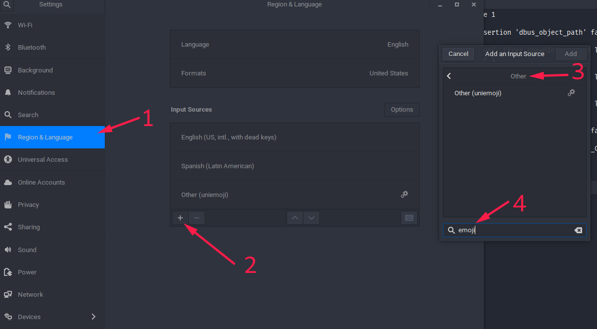
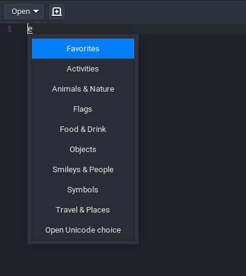
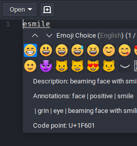
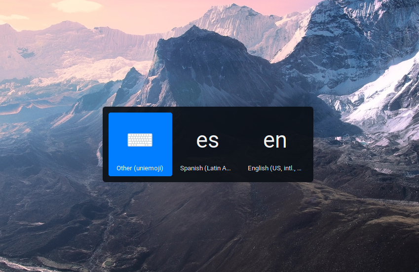

# Emoji
Como configurar en Manjaro


**Variaciones de Emoji:**

- https://github.com/samuelngs/apple-emoji-linux
- De google: https://www.google.com/get/noto/help/emoji/ (Descargara ~1G, descomprimir y buscar: `NotoColorEmoji.ttf`) .
- Emojione: https://github.com/emojione/emojione-assets/releases `emojione-android.ttf`.
- Tambien se pueden descargar de [aqui ios](https://github.com/samuelngs/apple-emoji-linux?tab=readme-ov-file)

Nota: Dejo una copia en (assets/fonts.zip) 😎.


**Instalar**
1. Desinstalar toda fuente noto emoji del sistema
2. Instalar fuente
	a. La fuente que se escoja ponerla en: `~/.local/share/fonts/Emoji` ó yo recomiendo en: `/usr/share/fonts/Emoji`.
	b. Instalar la fuente de google desde el repositorio buscando: `noto-fonts-emoji`.
3. Actualizar cache `sudo fc-cache -f -v`


**Problemas**
Si despues de instalar la fuente no se ve bien en:


Crear un archivo en `~/.config/fontconfig/fonts.conf` 

```xml
<?xml version="1.0" encoding="UTF-8"?>
<!DOCTYPE fontconfig SYSTEM "fonts.dtd">
<fontconfig>
  <alias>
    <family>serif</family>
    <prefer>
      <family>Noto Color Emoji</family>
    </prefer>
  </alias>
  <alias>
    <family>sans-serif</family>
    <prefer>
      <family>Noto Color Emoji</family>
    </prefer>
  </alias>
  <alias>
    <family>monospace</family>
    <prefer>
      <family>Noto Color Emoji</family>
    </prefer>
  </alias>
</fontconfig>
```
Nota: renombrar `Noto Color Emoji` por el nombre real de la fuente, lo puedes sacar abriendo la fuente y  llendo a información, por ultimo actualizar cache `sudo fc-cache -f -v`.


**Visualizadores**
- https://eosrei.github.io/emojione-color-font/full-demo.html
- https://www.emojicopy.com/ (settings:Native)
- https://www.webpagefx.com/tools/emoji-cheat-sheet/

### Selector de Emoji

- **Default**
  En cajas de texto gtk `gedit` esposible desplegar el selector Gtk: <kbd>Ctrl</kbd> + <kbd>:</kbd>.


- **Gnome shell**
    Una extensión de gnome https://extensions.gnome.org/extension/1162/emoji-selector/.


- **UniEmoji Ibus**
    Este método funciona instalando AUR:`UniEmoji` * ultima version, recuerda despues de cada configuración: `ibus restart`, luego ir a Configuraciones del sistema `Settings/Region & Language/ (add input source) / others / uniemoji` :




Como funciona: oprime <kbd>Ctrl</kbd> + <kbd>Shift</kbd>  + <kbd>e</kbd>. aparecera una `e` y ahora <kbd>Space</kbd> desplega el menu.




En este punto ya se puede escribir el nombre del Emoji:





Tambien puedes con <kbd>Super</kbd> + <kbd>Space</kbd> cambia rápidamente por el método de entrada `Other (uniemoji)` 





Ahora al escribir:


