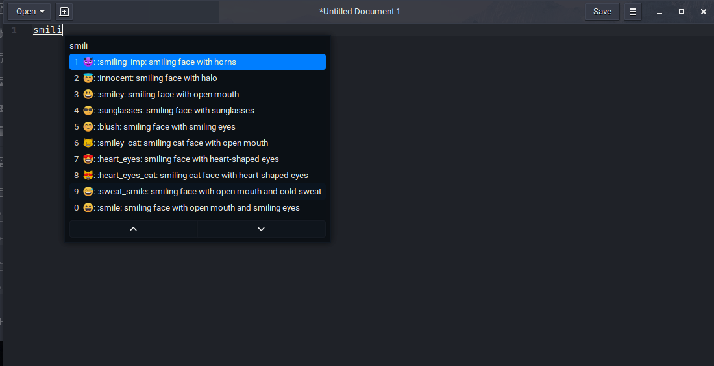

# Emoji
Como configurar en Manjaro


**Variaciones de Emoji:**

- De google: https://www.google.com/get/noto/help/emoji/ (Descargara ~1G, descomprimir y buscar: `NotoColorEmoji.ttf`) .
- Emojione: https://github.com/emojione/emojione-assets/releases `emojione-android.ttf`.

Nota: Dejo una copia en (assets/fonts.zip) 😎.


**Instalar**

1. Instalar fuente
	a. La fuente que se escoja ponerla en: `~/.local/share/fonts/Emoji` ó yo recomiendo en: `/usr/share/fonts/Emoji`.
	b. Instalar la fuente de google desde el repositorio buscando: `noto-fonts-emoji`.
2. Actualizar cache `sudo fc-cache -f -v`


**Problemas**
Si despues de instalar la fuente no se ve bien en:


Crear un archivo en `~/.config/fontconfig/fonts.conf` 

```xml
<?xml version="1.0" encoding="UTF-8"?>
<!DOCTYPE fontconfig SYSTEM "fonts.dtd">
<fontconfig>
  <alias>
    <family>serif</family>
    <prefer>
      <family>Noto Color Emoji</family>
    </prefer>
  </alias>
  <alias>
    <family>sans-serif</family>
    <prefer>
      <family>Noto Color Emoji</family>
    </prefer>
  </alias>
  <alias>
    <family>monospace</family>
    <prefer>
      <family>Noto Color Emoji</family>
    </prefer>
  </alias>
</fontconfig>
```
Nota: renombrar `Noto Color Emoji` por el nombre real de la fuente, lo puedes sacar abriendo la fuente y  llendo a información, por ultimo actualizar cache `sudo fc-cache -f -v`.


**Visualizadores**
- https://eosrei.github.io/emojione-color-font/full-demo.html
- https://www.emojicopy.com/ (settings:Native)
- https://www.webpagefx.com/tools/emoji-cheat-sheet/

**Selector de Emoji con Ibus**

Este método funciona instalando AUR:`UniEmoji`, luego ir a Configuraciones del sistema:
Settings/Region & Language/ (add input source) / others / uniemoji


Ahora  con <kbd>Super</kbd> + <kbd>Space</kbd> cambia rápidamente por el método de entrada `Other (uniemoji)` 


Ahora al escribir:





